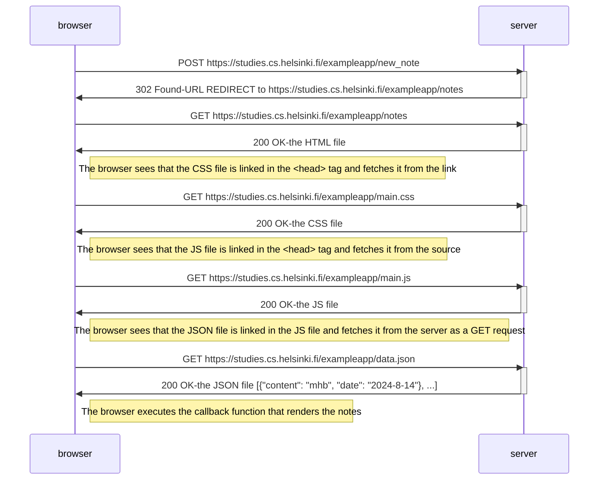

```mermaid
sequenceDiagram
participant browser
participant server

browser->>server: POST https://studies.cs.helsinki.fi/exampleapp/new_note
    activate server
    server->>browser: 302 Found-URL REDIRECT to https://studies.cs.helsinki.fi/exampleapp/notes
    deactivate server

    browser->>server: GET https://studies.cs.helsinki.fi/exampleapp/notes
    activate server
    server->>browser: 200 OK-the HTML file
    deactivate server

    Note right of browser: The browser sees that the CSS file is linked in the <head> tag and fetches it from the link

    browser->>server: GET https://studies.cs.helsinki.fi/exampleapp/main.css
    activate server
    server->>browser: 200 OK-the CSS file
    deactivate server

    Note right of browser: The browser sees that the JS file is linked in the <head> tag and fetches it from the source


    browser->>server: GET https://studies.cs.helsinki.fi/exampleapp/main.js
    activate server
    server->>browser: 200 OK-the JS file
    deactivate server

    Note right of browser: The browser sees that the JSON file is linked in the JS file and fetches it from the server as a GET request


    browser->>server: GET https://studies.cs.helsinki.fi/exampleapp/data.json
    activate server
    server->>browser: 200 OK-the JSON file [{"content": "mhb", "date": "2024-8-14"}, ...]
    deactivate server

    Note right of browser: The browser executes the callback function that renders the notes
```
